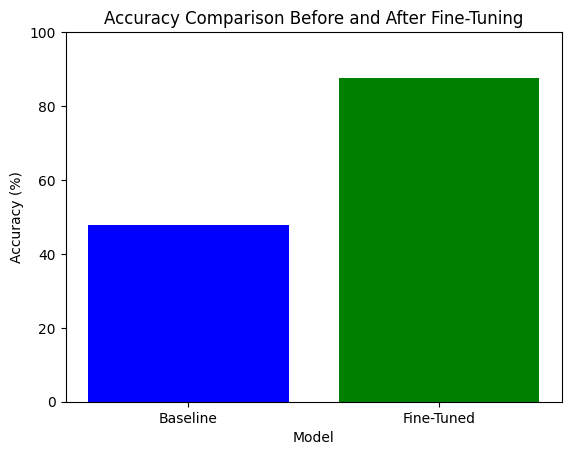
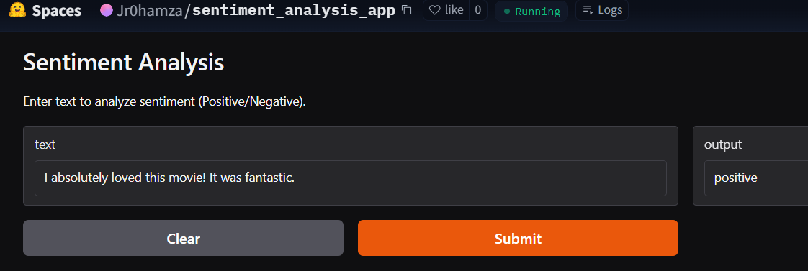

# **Sentiment Analysis Model**

## **Model Details**

### **Model Description**
This model is a **fine-tuned version of `distilbert-base-uncased`** for **binary sentiment analysis**.  
It is designed to classify text as either **positive** or **negative** sentiment.

## **project Description**
This project fine-tunes a binary sentiment analysis model using `distilbert-base-uncased`. The model classifies text as either positive or negative. The accuracy improves from 47.90% to 87.50% after fine-tuning. The model is deployed on Hugging Face Spaces with Gradio to provide a user-friendly interface for real-time sentiment classification.

- **Developed by:** HAMZA EL JIRARI  
- **Model type:** Transformer-based sentiment classifier  
- **Trained on:** IMDB dataset (labeled dataset for sentiment analysis)  
- **Library used:** `transformers`, `peft`  
- **License:** Apache 2.0  
- **Fine-tuned from:** `distilbert-base-uncased`
- **Hugging Face Repository:** [Jr0hamza/sentiment-analysis-model](https://huggingface.co/Jr0hamza/sentiment-analysis-model)
 
## **Features**

- Fine-tuned DistilBERT model for sentiment classification
  
- Hugging Face Transformers for efficient deep learning inference
  
- Gradio UI for easy model testing and interaction
  
- Deployment on Hugging Face Spaces for public accessibility

## **Performance: Accuracy Comparison**




| Model                 | Accuracy  |
|----------------------|----------|
| **Baseline (Pretrained)** | 47.90%  |
| **Fine-Tuned Model**  | 87.50%   |

The fine-tuning process significantly improved accuracy from **47.90% to 87.50%**, making the model much better for sentiment classification.

## **Uses**

### **Direct Use**
- Sentiment classification for English text  
- Can be used in chatbot responses, product reviews, and social media analysis  

## **Bias, Risks, and Limitations**
- The model may not perform well on texts with sarcasm, irony, or complex emotions  
- Potential biases due to the dataset used for training  


## **How to Get Started with the Model**


### **On Hugging Face Spaces**
-Visit the Hugging Face Space: [Jr0hamza/sentiment-analysis-model](https://huggingface.co/spaces/Jr0hamza/sentiment_analysis_app) 

-Enter any text in the input field.

-Click Submit to receive the sentiment classification.

-The result will be displayed as either Positive or Negative.

- **Example testing:** 




### **Locally**

Use the following Python code to classify text using the fine-tuned model:

```python
from transformers import pipeline

def classify_text(model_name, text):
    """
    Classifies text using a Hugging Face model and maps numeric labels to meaningful labels.

    Args:
        model_name (str): The name of the Hugging Face model.
        text (str): The input text to classify.

    Returns:
        dict: A dictionary with the predicted label and confidence score.
    """

    # Define custom label mapping
    label_map = {0: "negative", 1: "positive"}  

    # Load the pipeline
    classifier = pipeline("text-classification", model=model_name)

    # Get the prediction
    prediction = classifier(text)

    # Convert label ID to meaningful text
    for pred in prediction:
        pred["label"] = label_map[int(pred["label"].split("_")[-1])]  # Extract and map the label

    return prediction

# Example Usage:
model_name = "Jr0hamza/sentiment-analysis-model"
text = "I absolutely loved this movie! It was fantastic."
result = classify_text(model_name, text)
print(result) 
